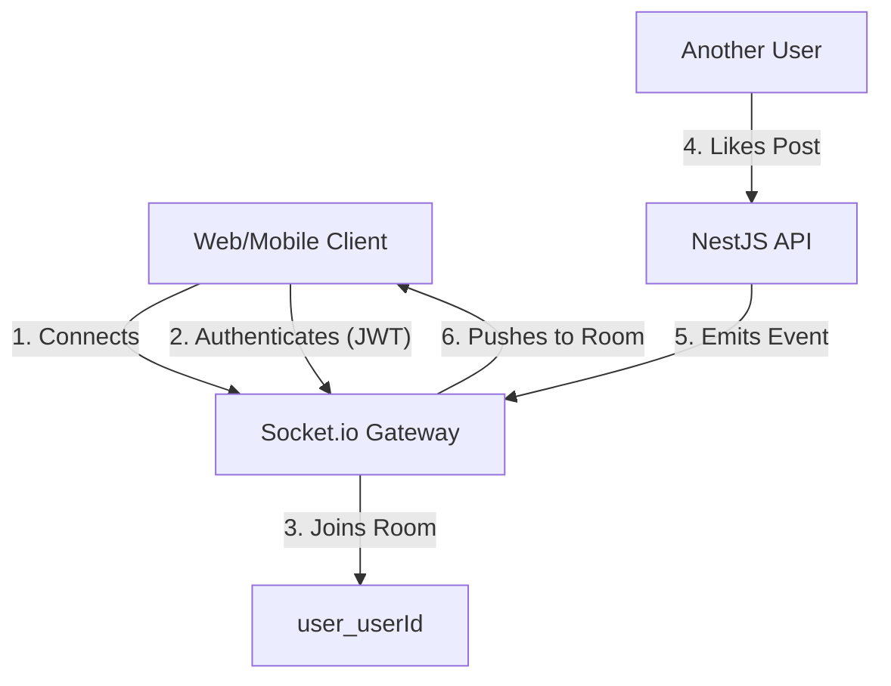

# Real-Time Updates Implementation Plan (Socket.io)

## 1. Concept: Optimistic UI vs. Real-Time
- **Optimistic UI (Current)**: When *you* like a post, the UI updates instantly because we "optimistically" assume the server request will succeed. This handles *your* actions.
- **Real-Time (Goal)**: When *someone else* likes *your* post, you see it instantly without refreshing. This handles *others'* actions.

## 2. Architecture
We will use **Socket.io**, which enables bi-directional communication between the server and client.

## 3. Implementation Steps

### Phase 1: Backend (NestJS)
1.  **Install Dependencies**: `npm install @nestjs/platform-socket.io @nestjs/websockets socket.io`
2.  **Create Gateway**: `src/notifications/notifications.gateway.ts`
    -   Handle connection/disconnection.
    -   Validate JWT token on connection.
    -   Join user to a private room: `client.join('user_' + userId)`.
3.  **Update Services**:
    -   Inject `NotificationsGateway` into `PostsService`.
    -   Emit events (`notification`) when creating notifications.

### Phase 2: Frontend (Web - Next.js)
1.  **Install Client**: `npm install socket.io-client`
2.  **Create Hook**: `hooks/use-socket.ts`
    -   Connect to server.
    -   Listen for `notification` events.
    -   Update React Query cache or global state (Zustand/Context) on new event.
3.  **UI Update**: Show a "toast" or increment notification badge instantly.

### Phase 3: Frontend (Mobile - Expo)
1.  **Install Client**: `npm install socket.io-client`
2.  **Update Context**: Add socket logic to `AuthContext` or a new `SocketContext`.
3.  **UI Update**: Similar to web, update badges/lists.

## 4. Development Workflow
-   **Local Development**: Works perfectly! Socket.io connects to `localhost:3001`.
-   **Testing**: Open two browser windows (User A and User B). Have User A like User B's post. Watch User B's screen update instantly.
