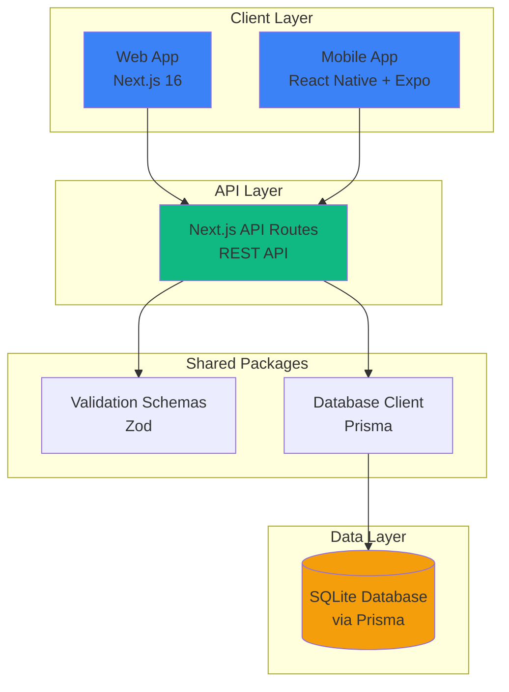
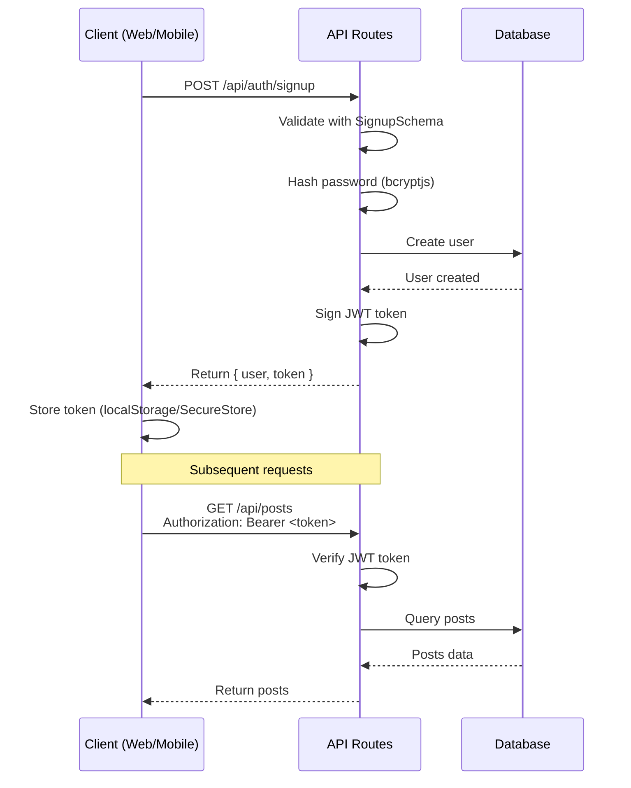
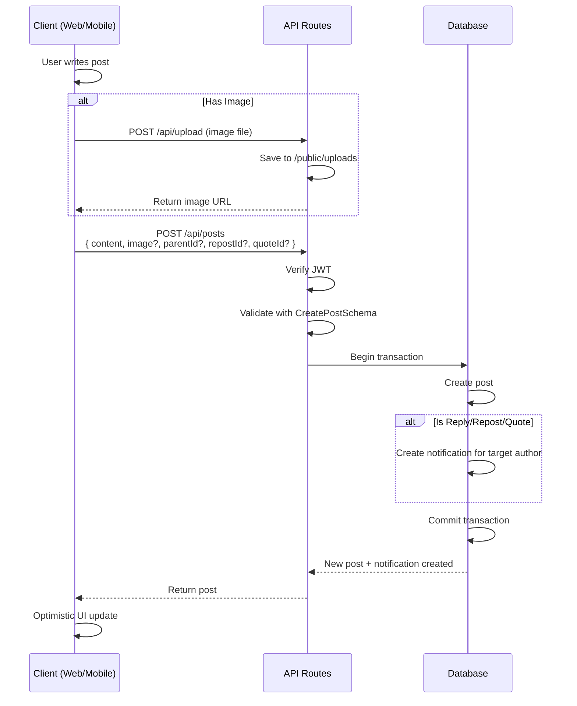
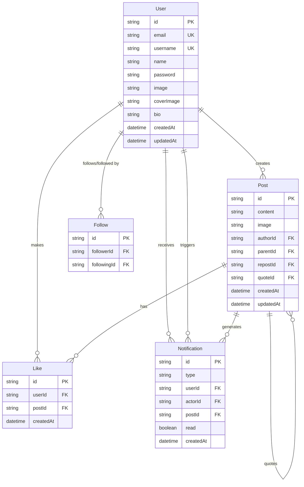
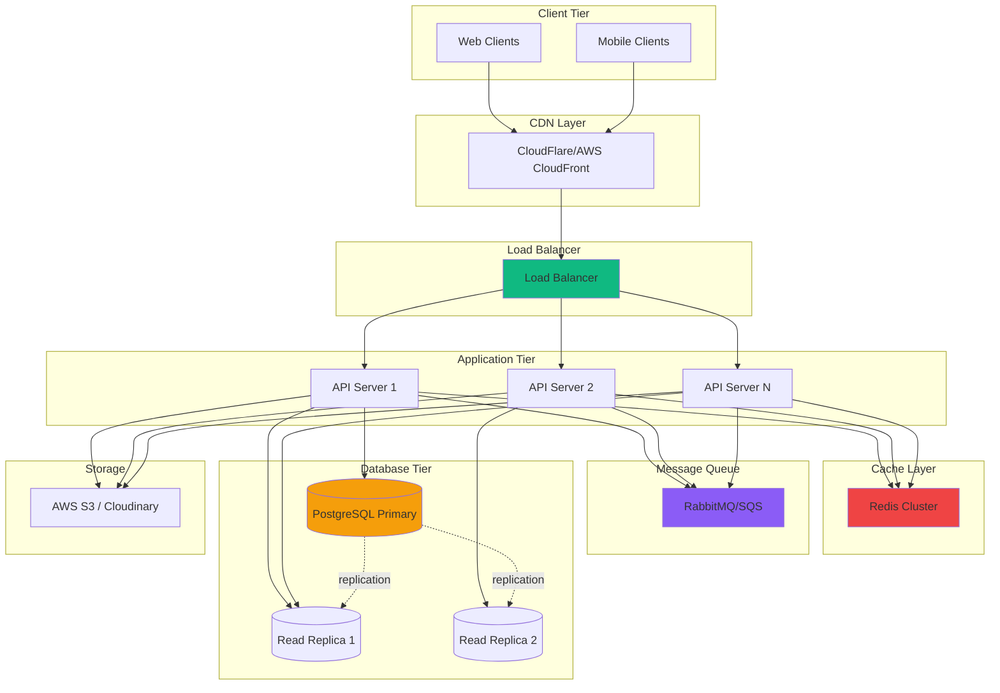

# Architecture Overview

This document provides a high-level overview of the X-Clone system architecture.

## System Overview



## Technology Stack

### Frontend

#### Web Application
- **Framework**: Next.js 16 with App Router
- **Language**: TypeScript
- **Styling**: Tailwind CSS v4
- **State Management**: React 19 (Server Components + Client Components)
- **UI Patterns**: Optimistic updates for instant feedback

#### Mobile Application
- **Framework**: React Native with Expo SDK 54
- **Language**: TypeScript
- **Styling**: NativeWind (Tailwind for React Native)
- **Navigation**: Expo Router
- **Storage**: Expo SecureStore for tokens, AsyncStorage for app data

### Backend

- **Framework**: Next.js API Routes (REST API)
- **Language**: TypeScript
- **Authentication**: JWT with bcryptjs
- **Validation**: Zod schemas (shared package)

### Database

- **Database**: SQLite
- **ORM**: Prisma
- **Migration**: Prisma Migrate

### Monorepo

- **Tool**: Turborepo
- **Package Manager**: npm workspaces
- **Build Orchestration**: Turbo task pipeline

## Data Flow

### Authentication Flow



### Post Creation Flow



## Component Architecture

### Monorepo Structure

```
Antigravity/
├── apps/
│   ├── web/                    # Next.js web application
│   │   ├── app/               # App Router pages and API routes
│   │   │   ├── api/          # REST API endpoints
│   │   │   ├── page.tsx      # Home page (feed)
│   │   │   ├── profile/      # User profiles
│   │   │   └── post/         # Post details
│   │   ├── components/        # React components
│   │   └── lib/              # Utilities (auth, etc.)
│   │
│   └── mobile/                # React Native mobile app
│       ├── app/              # Expo Router screens
│       ├── components/        # React Native components
│       ├── lib/              # Utilities
│       └── context/          # Auth context
│
└── packages/
    ├── db/                    # Shared database layer
    │   ├── prisma/
    │   │   └── schema.prisma  # Database schema
    │   └── src/
    │       └── index.ts       # Prisma client export
    │
    ├── schema/                # Shared validation schemas
    │   └── src/
    │       └── index.ts       # Zod schemas
    │
    ├── ui/                    # Shared UI components (future)
    ├── eslint-config/         # Shared ESLint config
    └── typescript-config/     # Shared TypeScript config
```

### Key Design Patterns

#### 1. Shared Validation Layer
- Validation schemas defined once in `@repo/schema`
- Used on both client and server
- Ensures type safety and consistency

```typescript
// packages/schema/src/index.ts
export const CreatePostSchema = z.object({
  content: z.string().max(10000).optional(),
  parentId: z.string().optional(),
  // ...
});

// Used in API
const validation = CreatePostSchema.safeParse(body);

// Used in frontend
const formData = CreatePostSchema.parse(formValues);
```

#### 2. Optimistic UI Updates
- Client immediately shows changes (like, follow)
- If API call fails, revert changes
- Provides instant feedback

```typescript
// Example: Optimistic like
setIsLiked(true);
setLikeCount(prev => prev + 1);

try {
  await likePost(postId);
} catch (error) {
  // Revert on failure
  setIsLiked(false);
  setLikeCount(prev => prev - 1);
}
```

#### 3. JWT Authentication
- Bearer token in Authorization header
- Token contains: userId, email, username
- Verified on every protected endpoint

## Database Schema

### Entity-Relationship Diagram



### Key Relationships

- **User → Posts**: One-to-many (a user can create multiple posts)
- **Post → Post (Replies)**: Self-referential (posts can reply to posts)
- **Post → Post (Reposts)**: Self-referential (posts can repost posts)
- **Post → Post (Quotes)**: Self-referential (posts can quote posts)
- **User ↔ User (Follows)**: Many-to-many through Follow table
- **User → Notifications**: One-to-many (user receives notifications)

## API Architecture

### API Route Structure

```
/api
├── /auth
│   ├── /signup          POST   - Create new user
│   └── /signin          POST   - Authenticate user
├── /me                  GET    - Get current user
├── /posts               
│   ├── GET                     - Get feed posts
│   └── POST                    - Create post
├── /posts/[id]
│   ├── GET                     - Get post details with replies
│   ├── POST                    - Like/unlike post (deprecated)
│   └── /like
│       └── POST                - Like/unlike post
├── /users/[id]
│   ├── GET                     - Get user profile
│   ├── PATCH                   - Update profile
│   └── /follow
│       └── POST                - Follow/unfollow user
├── /notifications       GET    - Get user notifications
├── /upload              POST   - Upload image
├── /search              GET    - Search users/posts
└── /health              GET    - Health check
```

### Authentication Middleware Pattern

All protected routes follow this pattern:

```typescript
export async function GET(request: Request) {
  // 1. Extract token
  const authHeader = request.headers.get('Authorization');
  const token = authHeader?.split(' ')[1];
  
  // 2. Verify token
  const payload = verifyToken(token);
  if (!payload) {
    return NextResponse.json({ error: 'Unauthorized' }, { status: 401 });
  }
  
  // 3. Use payload.userId for queries
  const userId = payload.userId;
  
  // 4. Business logic...
}
```

## Scalability Considerations

### Current Limitations

> [!CAUTION]
> The current architecture is **not production-ready** for high scale.

1. **SQLite**: Single-file database, no horizontal scaling
2. **No Caching**: Every request hits the database
3. **No Pagination**: Feed loads ALL posts
4. **Synchronous Notifications**: Blocks API responses
5. **No Rate Limiting**: Vulnerable to abuse

### Recommended Architecture for Scale



See [PROJECT_FEEDBACK.md](./PROJECT_FEEDBACK.md) for detailed scalability recommendations.

## Security Architecture

### Current Security Measures ✅

- JWT authentication
- Password hashing with bcryptjs
- Zod input validation
- HTTPS in production (recommended)

### Security Gaps ⚠️

See [PROJECT_FEEDBACK.md](./PROJECT_FEEDBACK.md) for detailed security concerns:
- No rate limiting
- No CSRF protection
- Weak password requirements
- No input sanitization
- Local file storage

## Deployment Architecture

### Current Setup (Development)

- Single SQLite file
- Next.js dev server (port 3000)
- Expo dev server (mobile)
- Local file uploads

### Recommended Production Setup

See [DEPLOYMENT.md](./DEPLOYMENT.md) for detailed deployment guide.

## Further Reading

- [DATABASE_SCHEMA.md](./DATABASE_SCHEMA.md) - Detailed database documentation
- [API_REFERENCE.md](./API_REFERENCE.md) - Complete API documentation
- [PROJECT_FEEDBACK.md](./PROJECT_FEEDBACK.md) - Architecture feedback and recommendations
