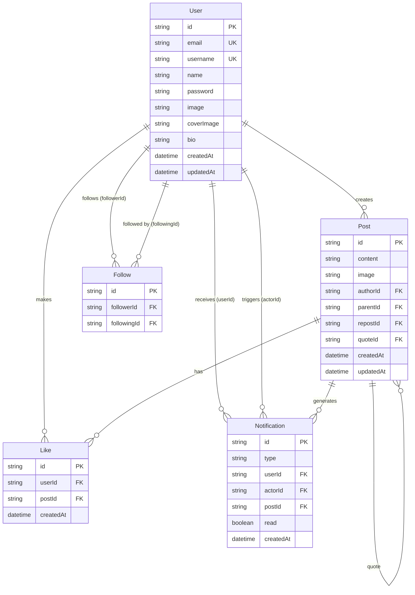

# Database Schema Documentation

Complete reference for the X-Clone database schema using Prisma ORM with SQLite.

## Overview

The database uses **SQLite** with **Prisma ORM** for type-safe database access. The schema is defined in [packages/db/prisma/schema.prisma](file:///c:/Users/netst/Desktop/Antigravity/packages/db/prisma/schema.prisma).

> [!WARNING]
> SQLite is suitable for development but **not recommended for production** at scale. See [PROJECT_FEEDBACK.md](./PROJECT_FEEDBACK.md) for migration recommendations to PostgreSQL.

---

## Entity-Relationship Diagram



---

## Models

### User

Represents a registered user account.

**Table Name**: `User`

**Fields**:

| Field | Type | Constraints | Description |
|-------|------|-------------|-------------|
| `id` | String | PK, `@default(cuid())` | Unique user identifier |
| `email` | String | Unique | User's email address |
| `username` | String | Unique | User's unique username |
| `name` | String? | Optional | Display name |
| `password` | String | Required | Hashed password (bcrypt) |
| `image` | String? | Optional | Profile image URL |
| `coverImage` | String? | Optional | Cover/banner image URL |
| `bio` | String? | Optional | User biography (max 160 chars) |
| `createdAt` | DateTime | `@default(now())` | Account creation timestamp |
| `updatedAt` | DateTime | `@updatedAt` | Last update timestamp |

**Relations**:
- `posts`: One-to-many with Post (posts created by user)
- `likes`: One-to-many with Like (likes made by user)
- `followers`: One-to-many with Follow (users following this user)
- `following`: One-to-many with Follow (users this user follows)
- `notifications`: One-to-many with Notification (notifications received)
- `sentNotifications`: One-to-many with Notification (notifications triggered by user)

**Indexes**:
- `email` (unique)
- `username` (unique)

**Example**:
```prisma
model User {
  id        String   @id @default(cuid())
  email     String   @unique
  username  String   @unique
  name      String?
  password  String
  image     String?
  coverImage String?
  bio       String?
  createdAt DateTime @default(now())
  updatedAt DateTime @updatedAt

  posts     Post[]
  likes     Like[]
  followers Follow[] @relation("UserFollows")
  following Follow[] @relation("UserFollowing")
  notifications     Notification[] @relation("UserNotifications")
  sentNotifications Notification[] @relation("NotificationActor")
}
```

---

### Post

Represents a post, reply, repost, or quote tweet.

**Table Name**: `Post`

**Fields**:

| Field | Type | Constraints | Description |
|-------|------|-------------|-------------|
| `id` | String | PK, `@default(cuid())` | Unique post identifier |
| `content` | String? | Optional | Post text content (max 10,000 chars) |
| `image` | String? | Optional | Attached image URL |
| `createdAt` | DateTime | `@default(now())` | Post creation timestamp |
| `updatedAt` | DateTime | `@updatedAt` | Last update timestamp |
| `authorId` | String | FK → User | Author's user ID |
| `parentId` | String? | Optional, FK → Post | Parent post ID (for replies) |
| `repostId` | String? | Optional, FK → Post | Reposted post ID |
| `quoteId` | String? | Optional, FK → Post | Quoted post ID |

**Relations**:
- `author`: Many-to-one with User (post author)
- `likes`: One-to-many with Like (likes on this post)
- `parent`: Many-to-one with Post (parent post for replies)
- `replies`: One-to-many with Post (replies to this post)
- `repost`: Many-to-one with Post (original post if this is a repost)
- `reposts`: One-to-many with Post (reposts of this post)
- `quote`: Many-to-one with Post (original post if this is a quote)
- `quotes`: One-to-many with Post (quotes of this post)
- `notifications`: One-to-many with Notification

**Post Types**:
1. **Regular Post**: `content` and/or `image`, no parent/repost/quote
2. **Reply**: Has `parentId`
3. **Repost**: Has `repostId` (pure repost, may have no content)
4. **Quote Tweet**: Has `quoteId` and `content`

**Example**:
```prisma
model Post {
  id        String   @id @default(cuid())
  content   String?
  image     String?
  createdAt DateTime @default(now())
  updatedAt DateTime @updatedAt
  authorId  String
  author    User     @relation(fields: [authorId], references: [id])
  likes     Like[]
  
  parentId  String?
  parent    Post?    @relation("PostReplies", fields: [parentId], references: [id])
  replies   Post[]   @relation("PostReplies")

  repostId  String?
  repost    Post?    @relation("PostReposts", fields: [repostId], references: [id])
  reposts   Post[]   @relation("PostReposts")

  quoteId   String?
  quote     Post?    @relation("PostQuotes", fields: [quoteId], references: [id])
  quotes    Post[]   @relation("PostQuotes")

  notifications Notification[]
}
```

---

### Like

Represents a user liking a post.

**Table Name**: `Like`

**Fields**:

| Field | Type | Constraints | Description |
|-------|------|-------------|-------------|
| `id` | String | PK, `@default(cuid())` | Unique like identifier |
| `createdAt` | DateTime | `@default(now())` | Like timestamp |
| `userId` | String | FK → User | User who liked |
| `postId` | String | FK → Post | Post that was liked |

**Relations**:
- `user`: Many-to-one with User
- `post`: Many-to-one with Post

**Unique Constraints**:
- `[userId, postId]`: A user can only like a post once

**Example**:
```prisma
model Like {
  id        String   @id @default(cuid())
  createdAt DateTime @default(now())
  userId    String
  user      User     @relation(fields: [userId], references: [id])
  postId    String
  post      Post     @relation(fields: [postId], references: [id])

  @@unique([userId, postId])
}
```

---

### Follow

Represents a user following another user.

**Table Name**: `Follow`

**Fields**:

| Field | Type | Constraints | Description |
|-------|------|-------------|-------------|
| `id` | String | PK, `@default(cuid())` | Unique follow identifier |
| `followerId` | String | FK → User | User who follows |
| `followingId` | String | FK → User | User being followed |

**Relations**:
- `follower`: Many-to-one with User (via `followerId`)
- `following`: Many-to-one with User (via `followingId`)

**Unique Constraints**:
- `[followerId, followingId]`: A user can only follow another user once

**Example**:
```prisma
model Follow {
  id          String   @id @default(cuid())
  followerId  String
  followingId String
  follower    User     @relation("UserFollowing", fields: [followerId], references: [id])
  following   User     @relation("UserFollows", fields: [followingId], references: [id])

  @@unique([followerId, followingId])
}
```

---

### Notification

Represents a notification sent to a user.

**Table Name**: `Notification`

**Fields**:

| Field | Type | Constraints | Description |
|-------|------|-------------|-------------|
| `id` | String | PK, `@default(cuid())` | Unique notification identifier |
| `type` | String | Required | Notification type (LIKE, FOLLOW, REPLY, REPOST, QUOTE) |
| `userId` | String | FK → User | User receiving the notification |
| `actorId` | String | FK → User | User who triggered the notification |
| `postId` | String? | Optional, FK → Post | Related post (if applicable) |
| `read` | Boolean | `@default(false)` | Whether notification has been read |
| `createdAt` | DateTime | `@default(now())` | Notification timestamp |

**Relations**:
- `user`: Many-to-one with User (notification recipient)
- `actor`: Many-to-one with User (user who triggered)
- `post`: Many-to-one with Post (related post, optional)

**Notification Types**:
- `LIKE`: Someone liked your post
- `FOLLOW`: Someone followed you (no postId)
- `REPLY`: Someone replied to your post
- `REPOST`: Someone reposted your post
- `QUOTE`: Someone quoted your post

**Example**:
```prisma
model Notification {
  id        String   @id @default(cuid())
  type      String   // LIKE, FOLLOW, REPLY, REPOST, QUOTE
  userId    String   // Recipient
  actorId   String   // Triggered by
  postId    String?  // Optional
  read      Boolean  @default(false)
  createdAt DateTime @default(now())

  user      User     @relation("UserNotifications", fields: [userId], references: [id])
  actor     User     @relation("NotificationActor", fields: [actorId], references: [id])
  post      Post?    @relation(fields: [postId], references: [id])
}
```

---

## Missing Recommendations

### 1. Add Indexes

> [!IMPORTANT]
> **Critical for performance**. The schema currently lacks indexes beyond auto-generated ones.

**Recommended Indexes**:

```prisma
model Post {
  // ... existing fields ...
  
  @@index([authorId, createdAt])
  @@index([parentId, createdAt])
  @@index([repostId])
  @@index([quoteId])
}

model Follow {
  // ... existing fields ...
  
  @@index([followerId])
  @@index([followingId])
}

model Notification {
  // ... existing fields ...
  
  @@index([userId, read, createdAt])
  @@index([actorId])
}
```

### 2. Add Enums for Type Safety

```prisma
enum NotificationType {
  LIKE
  FOLLOW
  REPLY
  REPOST
  QUOTE
  MENTION
}

model Notification {
  type NotificationType
  // ... rest of fields
}
```

### 3. Add Cascade Deletes

```prisma
model Post {
  author User @relation(fields: [authorId], references: [id], onDelete: Cascade)
}

model Like {
  user User @relation(fields: [userId], references: [id], onDelete: Cascade)
  post Post @relation(fields: [postId], references: [id], onDelete: Cascade)
}

model Follow {
  follower  User @relation("UserFollowing", fields: [followerId], references: [id], onDelete: Cascade)
  following User @relation("UserFollows", fields: [followingId], references: [id], onDelete: Cascade)
}
```

### 4. Add Soft Deletes

```prisma
model Post {
  // ... existing fields ...
  deletedAt DateTime?
}

model User {
  // ... existing fields ...
  deletedAt DateTime?
}
```

---

## Common Queries

### Get User with Stats

```typescript
const user = await prisma.user.findUnique({
  where: { id: userId },
  include: {
    _count: {
      select: {
        posts: true,
        followers: true,
        following: true
      }
    }
  }
});
```

### Get Feed Posts with Like Status

```typescript
const posts = await prisma.post.findMany({
  where: { parentId: null },
  include: {
    author: {
      select: {
        id: true,
        username: true,
        name: true,
        image: true
      }
    },
    _count: {
      select: { likes: true, replies: true, reposts: true, quotes: true }
    },
    likes: {
      where: { userId: currentUserId },
      select: { userId: true }
    }
  },
  orderBy: { createdAt: 'desc' }
});
```

### Get Thread (Post with Ancestors and Replies)

```typescript
// Get the post
const post = await prisma.post.findUnique({
  where: { id: postId },
  include: { author: true, _count: { select: { likes: true, replies: true } } }
});

// Get ancestors (recursively traverse parentId)
const ancestors = [];
let current = post;
while (current?.parentId) {
  const parent = await prisma.post.findUnique({
    where: { id: current.parentId },
    include: { author: true }
  });
  if (parent) ancestors.unshift(parent);
  current = parent;
}

// Get replies
const replies = await prisma.post.findMany({
  where: { parentId: postId },
  include: { author: true },
  orderBy: { createdAt: 'asc' }
});
```

---

## Migrations

### Running Migrations

```bash
cd packages/db
npx prisma migrate dev --name migration_name
```

### Generating Prisma Client

```bash
npx prisma generate
```

### Viewing Database

```bash
npx prisma studio
```

Opens a GUI at http://localhost:5555 to view/edit data.

---

## Schema File Location

The complete schema is located at:
- [packages/db/prisma/schema.prisma](file:///c:/Users/netst/Desktop/Antigravity/packages/db/prisma/schema.prisma)

---

## Further Reading

- [Prisma Documentation](https://www.prisma.io/docs)
- [PROJECT_FEEDBACK.md](./PROJECT_FEEDBACK.md) - Database optimization recommendations
- [ARCHITECTURE.md](./ARCHITECTURE.md) - System architecture overview
