# Development Workflow & Architecture

This guide explains how to develop the application locally while interacting with cloud services.

## 🌍 The "Hybrid" Architecture

We use a **Local Code + Cloud Data** approach. This allows you to develop features on your machine without needing to run complex databases locally.

```mermaid
graph TD
    subgraph "Your Computer (Localhost)"
        Web[🖥️ Web App\nlocalhost:3000]
        Mobile[📱 Mobile App\nExpo Go]
        API[⚙️ API Server\nlocalhost:3001]
    end

    subgraph "The Cloud (Production)"
        DB[(🛢️ Neon Postgres)]
        Storage[(☁️ Cloudinary)]
    end

    Web -->|HTTP| API
    Mobile -->|HTTP| API
    API -->|Connects via .env| DB
    API -->|Connects via keys| Storage
```



---

## 🚀 How to Start Developing

### 1. Start the API & Web
```bash
# In the root folder
npm run dev
```
*   **Web App:** Opens at `http://localhost:3000`.
*   **API:** Runs at `http://localhost:3001`.
    *   *Note:* The API connects to the **Live Neon Database** using the `DATABASE_URL` in `apps/api/.env`.

### 2. Start the Mobile App
```bash
# In apps/mobile
npx expo start --clear
```
*   Scan the QR code with your phone.
*   **Smart Switching:** The app automatically detects it is in "Dev Mode" and connects to your computer's API (`http://YOUR_IP:3001`) instead of the production server.

---

## 🔄 How Data Works (Important!)

Since we use a **Shared Database**, please be careful.

*   **Creating Data:** If you create a test user "TestUser1" locally, they **WILL** appear on the live website.
*   **Deleting Data:** If you delete a user locally, they are **GONE** from the live website.
*   **Images:** Uploading an image locally sends it to the **Live Cloudinary** account.

> **Tip:** Treat your local environment as "Production with Editing Powers".

---

## 🛠️ Configuration Reference

### Web (`apps/web/lib/api.ts`)
Logic: Uses `process.env.NEXT_PUBLIC_API_URL` or defaults to localhost.
```typescript
const rawUrl = process.env.NEXT_PUBLIC_API_URL || 'http://localhost:3001';
```

### Mobile (`apps/mobile/constants.ts`)
Logic: dynamic switching based on `__DEV__` flag.
```typescript
export const BASE_URL = __DEV__ ? getLocalApiUrl() : productionUrl;
```

### API (`apps/api/.env`)
Logic: Direct connection strings.
```bash
DATABASE_URL="postgres://..." # Connects to Neon
CLOUDINARY_URL="..."         # Connects to Cloudinary
```
